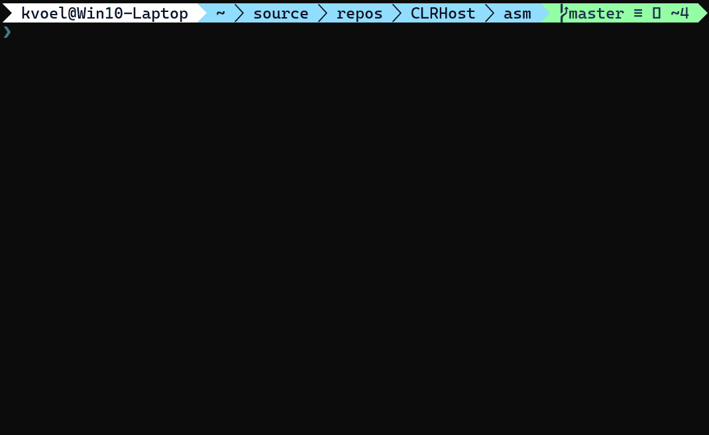

# CLRHost

x86_64 assembly lanaguage application that hosts the .NET CLR and runs a C# console application.

## Requirements
GoAsm 0.61.0.1 (http://www.godevtool.com/)

EasyCode IDE (https://www.easycode.cat/English/index.htm)

C# compiler

## Building

### Assembling and linking the host 
```PowerShell
C:\goasm\bin\goasm.exe /x64 /ni clrhost.obj clrhost.asm
C:\goasm\bin\golink /no /debug coff /console /fo clrhost.exe clrhost.obj kernel32.dll user32.dll mscoree.dll
```

### Compiling the hosted application
```C#
C:\windows\microsoft.net\Framework64\v4.0.30319\csc.exe /out:Hostedapp.exe program.cs
```

### Copy the executables
Copy both of the executables you just created (CLRHost.exe & HostedApp.exe) and put them into the same directory.

## Usage

From a PowerShell window or Command Prompt run the CLRHost.exe



## License
[MIT](https://choosealicense.com/licenses/mit/)